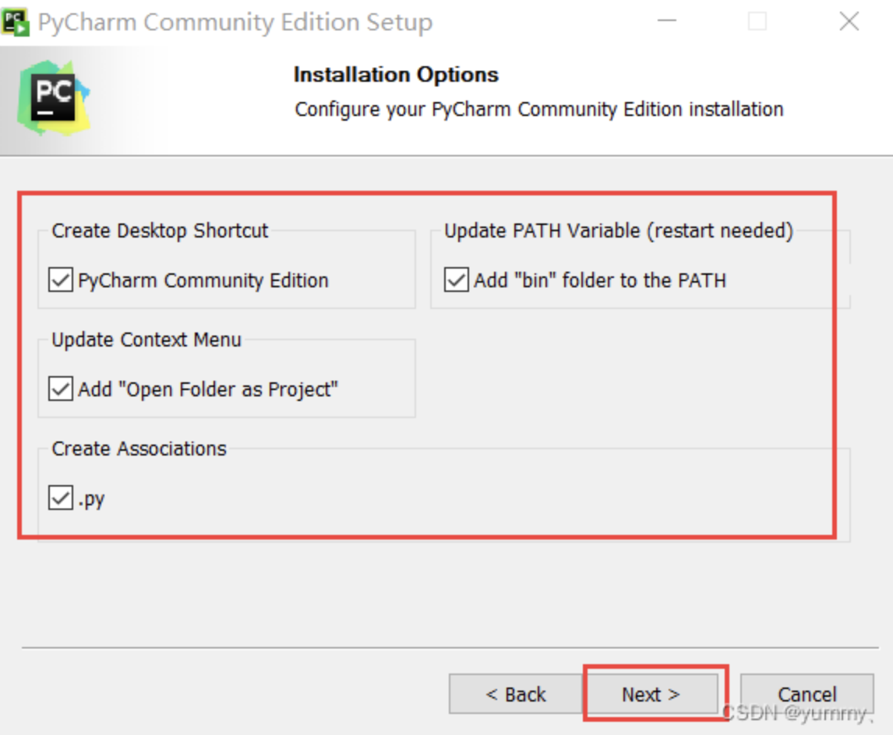
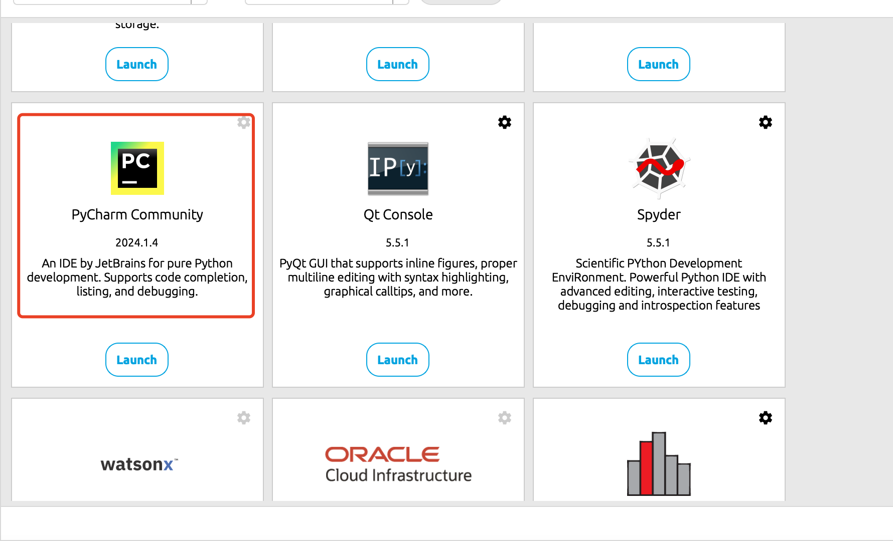
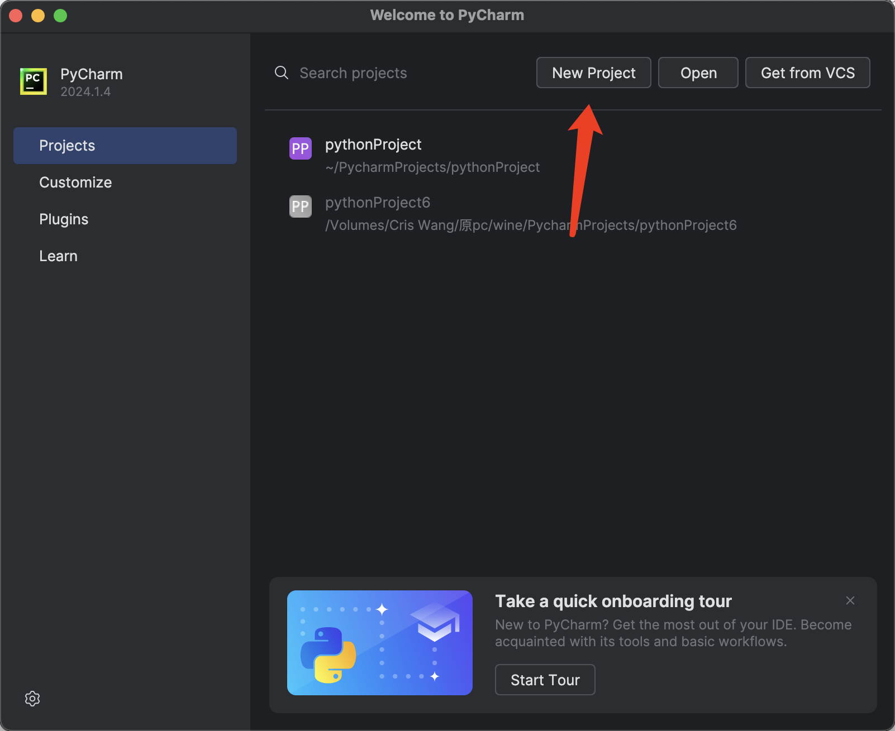
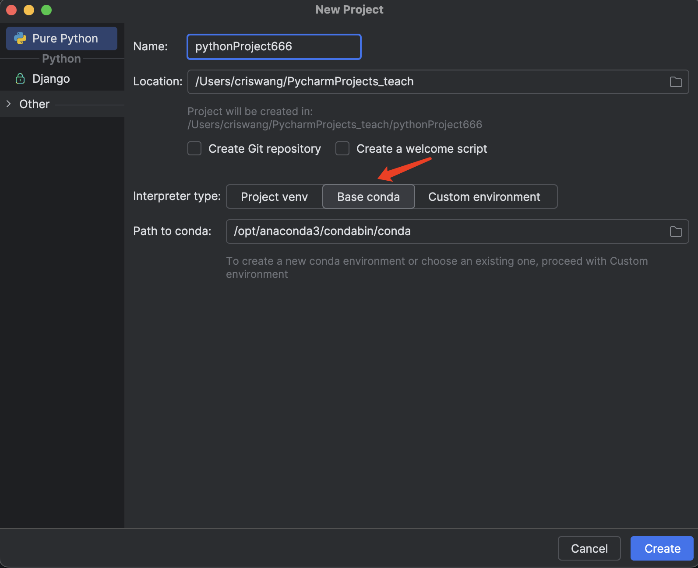
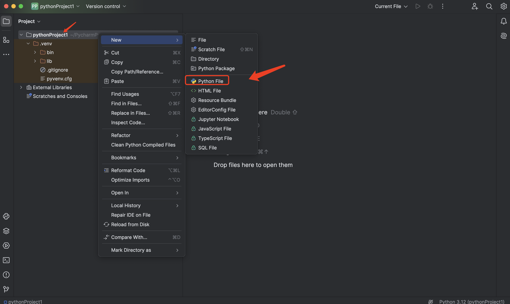
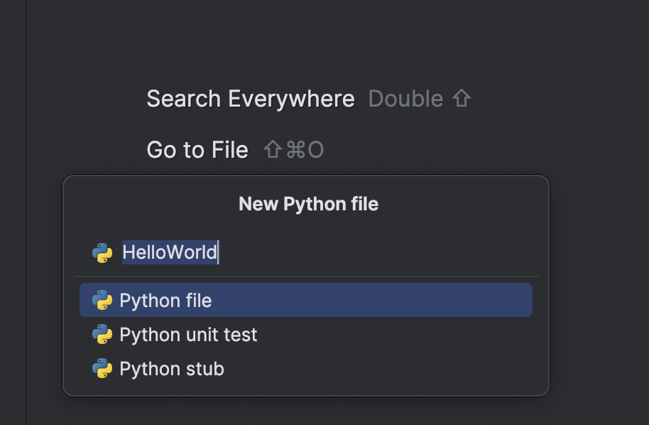
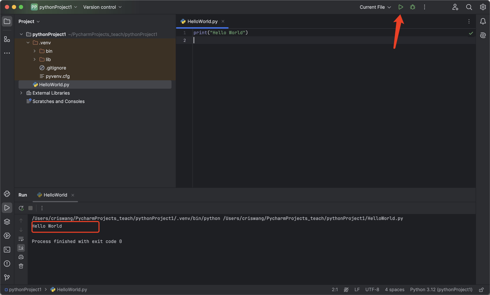

# Lesson 1 Python的环境设置、数据类型、运算符和输入和输出
# 目录

- [Lesson 1 Python的环境设置、数据类型、运算符和输入和输出](#lesson-1-python的环境设置数据类型运算符和输入和输出)
  - [前言：为什么要学习Python](#前言为什么要学习python)
  - [1. Python环境设置](#1-python环境设置)
    - [1.1 为什么选择Anaconda](#11-为什么选择anaconda)
    - [1.2 Anaconda 安装](#12-anaconda-安装)
      - [1.2.1 macOS 平台](#121-macos-平台)
      - [1.2.2 Win 平台](#122win-平台)
    - [1.3 Pycharm安装](#13-pycharm安装)
  - [2. 第一个程序：Hello World！](#2-第一个程序hello-world)
  - [3. Python常用的开发环境（IDE）](#3-python常用的开发环境ide)
    - [3.1 PyCharm](#31-pycharm)
    - [3.2 Visual Studio Code](#32-visual-studio-code)
    - [3.3 Jupyter Notebook](#33-jupyter-notebook)
  - [4. Python中的标识符](#4-python中的标识符)
    - [4.1 标识符](#41-标识符)
    - [4.2 Python 保留字符](#42-python-保留字符)
    - [4.3 注释](#43-注释)
    - [4.4 行和缩进](#44-行和缩进)
  - [5. Python中的变量](#5-python中的变量)
    - [5.1 多个变量赋值](#51-多个变量赋值)
  - [6. Python的数据类型](#6-python的数据类型)
    - [6.1 基本数据类型](#61-基本数据类型)
      - [6.1.1 数字类型](#611-数字类型)
      - [6.1.2 字符串](#612-字符串)
      - [6.1.3 bool（布尔类型）](#613-bool布尔类型)
      - [6.1.4 List（列表）](#614-list列表)
      - [6.1.5 Tuple（元组）](#615-tuple元组)
      - [6.1.6 Set（集合）](#616-set集合)
      - [6.1.7 Dictionary（字典）](#617-dictionary字典)
    - [6.2 常用数据类型的使用实例](#62-常用数据类型的使用实例)
  - [7. Python中的运算符](#7-python中的运算符)
    - [7.1 Python算术运算符](#71-python算术运算符)
    - [7.2 Python 比较运算符](#72-python-比较运算符)
    - [7.3 Python赋值运算符](#73-python赋值运算符)
    - [7.4 Python位运算符](#74-python位运算符)
    - [7.5 Python逻辑运算符](#75-python逻辑运算符)
    - [7.6 Python成员运算符](#76-python成员运算符)
    - [7.7 Python身份运算符](#77-python身份运算符)
  - [8. Python的输入与输出](#8-python的输入与输出)
    - [8.1 使用 input 读取字符串/整数/浮点数](#81-使用-input-读取字符串整数浮点数)
    - [8.2 print 输出](#82-print-输出)
  - [9. 课程总结](#9-课程总结)
  - [课后练习](#课后练习)

## 前言：为什么要学习Python

- 易于学习：Python语法简单，适合初学者。
- 应用广泛：可用于数据分析、网站开发、自动化等。
- 丰富的库支持：提供大量现成的工具和功能，方便快速开发。

## 1. Python环境设置

### 1.1 为什么选择Anaconda

- **方便安装：** 安装 Anaconda就像安装一个应用程序一样简单，它为您预先安装好了许多常用的工具，无需单独配置。
- **包管理器：** Anaconda 包含一个名为 Conda 的包管理器，用于安装、更新和管理软件包。Conda 不仅限于 Python，还支持多种其他语言的包管理。
- **环境管理：** 使用 Anaconda，您可以轻松地创建和管理多个独立的 Python 环境，然后实现自由切换。这对于在不同项目中使用不同的库和工具版本非常有用，以避免版本冲突。
- **集成工具和库：** Anaconda 捆绑了许多用于数据科学、机器学习和科学计算的重要工具和库，如 NumPy、Pandas、Matplotlib、SciPy、Scikit-learn 等。
- **Jupyter 笔记本：** Jupyter 是一个交互式的计算环境，支持多种编程语言，但在 Anaconda 中主要用于 Python。它允许用户创建和共享包含实时代码、方程式、可视化和叙述文本的文档。
- **跨平台性：** Anaconda 可在 Windows、macOS 和 Linux 等操作系统上运行，使其成为一个跨平台的解决方案。
- **社区支持：** Anaconda 拥有庞大的社区，用户可以在社区论坛上获取帮助、分享经验和解决问题。

### 1.2 Anaconda 安装

Anaconda 安装包下载地址：https://www.anaconda.com/download。

Anaconda 可在 Windows、macOS 和 Linux 等操作系统上运行，你可以根据不同平台下载安装包：


#### 1.2.1 macOS 平台

安装过程也很简单，双击打开下载的安装包，选择 **Install for me only**:


点击 **install** 按钮：


安装完成后，点击 **Continue** 按钮，接下来就可以看到安装完成的界面：


macOS 平台安装可以参考官网：https://docs.anaconda.com/free/anaconda/install/mac-os/

#### 1.2.2 Win 平台

Win 平台与 macOS 类似，在下载安装包后，双击安装包，同意一些协议，简单的就可以按默认设置一步步按 Next 按钮就可以。

选择安装目录：


在 "Advanced Installation Options" 中不要勾选 "Add Anaconda to my PATH environment variable."（"添加Anaconda至我的环境变量。"），因为如果勾选，则将会影响其他程序的使用。


点击 Install 按钮进行安装，安装成功出现如下界面：


点击 **Next** 按钮：


Win 平台安装可以参考官网：https://docs.anaconda.com/free/anaconda/install/windows/

### 1.2 Pycharm安装

我们直接打开pycharm官网进行下载安装：https://www.jetbrains.com/pycharm/download/


页面往下滑到底，下载这个免费的社区版，

mac用户只需下载后进行拖拽安装就可以打开了。

如果是win用户，安装时需要注意自己的安装位置（如果C盘太小不建议放C盘，一般选择64位安装，根据自己电脑实际需求），其他选项一般默认即可。

直接打开Pycharm，或者在Anaconda中打开Pycharm社区版

一般第一次打开我们新建一个项目就可以，一个项目是一个文件夹，我们可以在里面创建多个文件



在Anaconda安装好的情况下，选择基于conda的环境，其他所有选项默认即可，点击右下角创建第一个项目。

然后点击创建，我们在:文件夹的位置右击创建一个新的python文件，开始我们的第一段代码。




### 2. 第一个程序：Hello World！

得益于Python简单的语法和高的可读性，只需一行即可完成我们的第一个程序。

```
print("Hello World")
```

我们在输入这一行代码后，只需点击右上角的运行，即可在控制台看到我们的输出。



### 3. Python常用的开发环境（IDE）

集成开发环境（IDE）专为软件开发而设计，提供多种功能以简化开发过程。对于 Python 来说，有各种可用的 IDE，每个 IDE 都提供独特的优势和功能来满足不同的开发需求。

#### 3.1 PyCharm

PyCharm 是 JetBrains 开发的一款功能强大的 Python IDE，专为 Python 开发人员的需求而量身定制。它提供了一系列全面的功能，包括：

- **智能代码完成**：PyCharm 提供上下文感知的代码完成，可建议代码片段、库和变量名称。
- **错误检测和快速修复**：PyCharm 实时扫描代码，检测错误并提供快速修复建议。
- **单元测试集成**：PyCharm 与流行的单元测试框架（如 pytest 和 nose）集成，允许轻松运行和调试测试。
- **版本控制集成**：PyCharm 支持流行的版本控制系统（如 Git 和 Mercurial），简化了协作和代码管理。
- **强大的调试器**：PyCharm 提供了一个功能强大的调试器，可用于逐步执行代码、设置断点和检查变量值。

**优点**：

- 广泛的功能集
- 用户友好界面
- 出色的代码完成和错误检测
- 与其他工具和插件的无缝集成

**缺点**：

- 可能有点贵（专业版），尤其是对于初学者
- 大型:可能会减慢速度

#### 3.2 Visual Studio Code

Visual Studio Code (VSCode) 是 Microsoft 开发的一个免费且开源的跨平台 IDE。它是 Python 开发人员中最受欢迎的选择之一，其特点包括：

- **轻量级和快速**：VSCode 是一个轻量级的 IDE，在启动和加载:时非常快。
- **定制化程度高**：VSCode 允许用户通过主题、扩展和设置对 IDE 进行高度定制。
- **内置调试器**：VSCode 提供了一个内置调试器，可用于调试代码并设置断点。
- **终端集成**：VSCode 集成了一个终端，允许用户在 IDE 中轻松运行命令和脚本。
- **代码片段和代码辅助**：VSCode 提供了丰富的代码片段库和代码辅助功能，以加快开发速度。

**优点**：

- 免费且开源
- 轻量级且快速
- 高度可定制
- 庞大的扩展生态系统

**缺点**：

- IDE可能没有包含一些在其他IDE中常见的原生特性或功能，某些高级功能需要安装扩展，对新手不友好

#### 3.3 Jupyter Notebook

Jupyter Notebook 是一个基于浏览器的交互式笔记本环境，非常适合探索数据、原型设计和创建可重复的文档。Python 开发人员可以使用它来：

- **执行代码块**：Notebook 允许用户编写并执行 Python 代码块，并在单独的单元格中查看结果。
- **可视化数据**：Notebook 集成了各种可视化库，允许用户创建交互式可视化和图表。
- **文档和协作**：Notebook 提供了一个标记语言，允许用户创建交互式、可文档化的文档。
- **分享和嵌入**：Notebook 可以轻松共享和嵌入到其他平台中，例如博客和网站。

**优点**：

- 交互式和探索性
- 易于创建可重复的文档
- 适用于数据科学和机器学习任务

**缺点**：

- 对于大型项目可能不适合
- 缺乏某些 IDE 中发现的调试和版本控制功能

Pycharm相比于VS Code最好的点在于功能全面且开箱即用，而VSCode可能还要下载一些插件环境或者进行额外配置。VSCode好在插件社区强大，因此支持最新的如GitHub Copilot的大模型自动补充功能。Jupyter的特点是可以每写一行就看到执行的结果，比其他两个编辑器更适合开发复杂的流程。

Anaconda因其全面的集成，对于初学者是极其友好的，虽然功能上会有些冗余，但其简单的环境配置以及全面的功能赢得了许多人的喜爱。Anaconda自带最新python版本，因此我们无需再额外下载和配置环境，这对于初学者来说是可以极大的提升信心的（配置环境繁琐过程是劝退初学者的一大因素），在对编程进行一定程度的熟悉后，大家可以探索最适合自己的IDE。

### 4. Python中的标识符

#### 4.1 标识符

- 第一个字符必须是字母表中字母或下划线 **_** 。
- 标识符的其他的部分由字母、数字和下划线组成。
- 标识符对大小写敏感。

在 Python 3 中，可以用中文作为变量名，非 ASCII 标识符也是允许的了。

#### 4.2 Python 保留字符

保留字即关键字，我们不能把它们用作任何标识符名称。

| False  | None  | True  | and     | as       |
|--------|-------|-------|---------|----------|
| assert | break | class | continue | def      |
| del    | elif  | else  | except  | finally  |
| for    | from  | global | if     | import   |
| in     | is    | lambda | nonlocal | not    |
| or     | pass  | raise | return  | try      |
| while  | with  | yield |         |          |

#### 4.3 注释

Python中单行注释以 **#** 开头，实例如下：

```
# 第一个注释
print("Hello, Python!") # 第二个注释
```

执行以上代码，输出结果为：

```
Hello, Python!
```

多行注释可以用多个 **#** 号，还有 **'''** 和 **" " "**：

```
# 第一个注释
# 第二个注释
 
'''
第三注释
第四注释
'''
 
"""
第五注释
第六注释
"""
print("Hello, Python!")
```

执行以上代码，输出结果为：

```
Hello, Python!
```

#### 4.4 行和缩进

python最具特色的就是使用缩进来表示代码块，不需要使用大括号 **{}** 。

缩进的空格数是可变的，但是同一个代码块的语句必须包含相同的缩进空格数。实例如下：

```
if True:
    print("True")
else:
    print("False")
```

以下代码最后一行语句缩进数的空格数不一致，会导致运行错误：

```
if True:
    print("Answer")
    print("True")
else:
    print("Answer")
  print("False")    # 缩进不一致，会导致运行错误
```

以上程序由于缩进不一致，执行后会出现类似以下错误：

```
 File "test.py", line 6
    print("False")    # 缩进不一致，会导致运行错误
                                      ^
IndentationError: unindent does not match any outer indentation level
```

### 5 Python中的变量

Python 中的变量不需要声明。每个变量在使用前都必须赋值，变量赋值以后该变量才会被创建。

在 Python 中，变量就是变量，它没有类型，我们所说的"类型"是变量所指的内存中对象的类型。

等号（=）用来给变量赋值。

等号（=）运算符左边是一个变量名,等号（=）运算符右边是存储在变量中的值。例如：

```
counter = 100          # 整型变量
miles   = 1000.0       # 浮点型变量
name    = "CodeRaft"     # 字符串

print(counter)
print(miles)
print(name)
```

执行以上程序会输出如下结果：

```
100
1000.0
CodeRaft
```

#### 5.1 多个变量赋值

Python允许你同时为多个变量赋值。例如：

```
a = b = c = 1
```

以上实例，创建一个整型对象，值为 1，从后向前赋值，三个变量被赋予相同的数值。

您也可以为多个对象指定多个变量。例如：

```
a, b, c = 1, 2, "CodeRaft"
```

以上实例，两个整型对象 1 和 2 的分配给变量 a 和 b，字符串对象 "CodeRaft" 分配给变量 c。


## 6 Python的数据类型

Python中的数据类型极为丰富，包括基本数据类型和高级数据结构。在Python中，变量无需声明即可直接使用，其类型由赋值时所存储的对象决定。

### 6.1基本数据类型

#### 6.1.1 数字类型

- **整型（int）**：没有大小限制，理论上受限于机器内存。
- **浮点型（float）**：通常情况下的浮点数表示方法，可以使用科学计数法（如1.23e9）。
- **布尔型（bool）**：包括True和False两种值，实际上是整型的子类型，True等于1，False等于0。

```
a = 3           # int
b = 3.14        # float
c = True        # bool
```

#### 6.1.2 字符串

- **字符串（str）**：文本类型，使用单引号或双引号包围。
- 字符串是不可变序列，可以进行索引、切片、加法和乘法操作。

```
str1 = "Hello"
str2 = 'World'
print(str1 + " " + str2)  # 字符串连接
print(str1 * 3)           # 字符串重复
```

这样输出的结果为：

```
Hello World
HelloHelloHello
```

在Python中，str()函数可以将任何数据类型转换成字符串类型，而int()函数则可以将字符串或数字转换为整数类型，但前提是这个字符串或数字必须表示一个有效的整数。
```
# 假设我们有一个整数和一个字符串
original_int = 123
original_str = "456"

# 使用str()函数将整数转换为字符串
int_as_str = str(original_int)
print("整数转换为字符串:", int_as_str)

# 使用int()函数将字符串转换回整数
str_as_int = int(original_str)
print("字符串转换为整数:", str_as_int)

# 注意：如果字符串包含非数字字符，int()函数会抛出ValueError
invalid_str = "abc"
try:
    invalid_int = int(invalid_str)
except ValueError:
    print("错误：无法将非数字字符串转换为整数")
```
输出结果：
```
整数转换为字符串: 123
字符串转换为整数: 456
错误：无法将非数字字符串转换为整数
```

#### 6.1.3 bool（布尔类型）

布尔类型即 True 或 False。

在 Python 中，True 和 False 都是关键字，表示布尔值。

布尔类型可以用来控制程序的流程，比如判断某个条件是否成立，或者在某个条件满足时执行某段代码。

布尔类型特点：

- 布尔类型只有两个值：True 和 False。
- bool 是 int 的子类，因此布尔值可以被看作整数来使用，其中 True 等价于 1。
- 布尔类型可以和其他数据类型进行比较，比如数字、字符串等。在比较时，Python 会将 True 视为 1，False 视为 0。
- 布尔类型可以和逻辑运算符一起使用，包括 and、or 和 not。这些运算符可以用来组合多个布尔表达式，生成一个新的布尔值。
- 布尔类型也可以被转换成其他数据类型，比如整数、浮点数和字符串。在转换时，True 会被转换成 1，False 会被转换成 0。
- 可以使用 `bool()` 函数将其他类型的值转换为布尔值。以下值在转换为布尔值时为 `False`：`None`、`False`、零 (`0`、`0.0`、`0j`)、空序列（如 `''`、`()`、`[]`）和空映射（如 `{}`）。其他所有值转换为布尔值时均为 `True`。

#### 6.1.4 List（列表）

List（列表） 是 Python 中使用最频繁的数据类型。

列表可以完成大多数集合类的数据结构实现。列表中元素的类型可以不相同，它支持数字，字符串甚至可以包含列表（所谓嵌套）。

列表是写在方括号 **[]** 之间、用逗号分隔开的元素列表。

和字符串一样，列表同样可以被索引和截取，列表被截取后返回一个包含所需元素的新列表。

列表截取的语法格式如下：

```
变量[头下标:尾下标]
```

索引值以 **0** 为开始值，**-1** 为从末尾的开始位置。


加号 **+** 是列表连接运算符，星号 * 是重复操作。如下实例：

```
list = [ 'abcd', 786 , 2.23, 'CodeRaft', 70.2 ]  # 定义一个列表
tinylist = [123, 'CodeRaft']

print(list)            # 打印整个列表
print(list[0])         # 打印列表的第一个元素
print(list[1:3])       # 打印列表第二到第四个元素（不包含第四个元素）
print(list[2:])        # 打印列表从第三个元素开始到末尾
print(tinylist * 2)    # 打印tinylist列表两次
print(list + tinylist)  # 打印两个列表拼接在一起的结果
```

以上实例输出结果：

```
['abcd', 786, 2.23, 'CodeRaft', 70.2]
abcd
[786, 2.23]
[2.23, 'CodeRaft', 70.2]
[123, 'CodeRaft', 123, 'CodeRaft']
['abcd', 786, 2.23, 'CodeRaft', 70.2, 123, 'CodeRaft']
```
#### 6.1.5 Tuple（元组）

元组（tuple）与列表类似，不同之处在于元组的元素不能修改。元组写在小括号 **()** 里，元素之间用逗号隔开。

元组中的元素类型也可以不相同：

```
tuple = ( 'abcd', 786 , 2.23, 'CodeRaft', 70.2  )
tinytuple = (123, 'CodeRaft')

print(tuple)             # 输出完整元组
print(tuple[0])          # 输出元组的第一个元素
print(tuple[1:3])        # 输出从第二个元素开始到第三个元素
print(tuple[2:])         # 输出从第三个元素开始的所有元素
print(tinytuple * 2)     # 输出两次元组
print(tuple + tinytuple) # 连接元组
```

以上实例输出结果：

```
('abcd', 786, 2.23, 'CodeRaft', 70.2)
abcd
(786, 2.23)
(2.23, 'CodeRaft', 70.2)
(123, 'CodeRaft', 123, 'CodeRaft')
('abcd', 786, 2.23, 'CodeRaft', 70.2, 123, 'CodeRaft')
```

#### 6.1.6 Set（集合）

Python 中的集合（Set）是一种无序、可变的数据类型，用于存储唯一的元素。

集合中的元素不会重复，并且可以进行交集、并集、差集等常见的集合操作。

在 Python 中，集合使用大括号 **{}** 表示，元素之间用逗号 **,** 分隔。

另外，也可以使用 **set()** 函数创建集合。

**注意：**创建一个空集合必须用 **set()** 而不是 **{ }**，因为 **{ }** 是用来创建一个空字典。

创建格式：

```
parame = {value01,value02,...}
或者
set(value)
```


```
sites = {'Google', 'Taobao', 'Runoob', 'Facebook', 'Zhihu', 'Baidu'}

print(sites)   # 输出集合，重复的元素被自动去掉

# 成员测试
if 'Runoob' in sites :
    print('Runoob 在集合中')
else :
    print('Runoob 不在集合中')


# set可以进行集合运算
a = set('abracadabra')
b = set('alacazam')

print(a)

print(a - b)     # a 和 b 的差集

print(a | b)     # a 和 b 的并集

print(a & b)     # a 和 b 的交集

print(a ^ b)     # a 和 b 中不同时存在的元素
```

以上实例输出结果：

```
{'Zhihu', 'Baidu', 'Taobao', 'Runoob', 'Google', 'Facebook'}
Runoob 在集合中
{'b', 'c', 'a', 'r', 'd'}
{'r', 'b', 'd'}
{'b', 'c', 'a', 'z', 'm', 'r', 'l', 'd'}
{'c', 'a'}
{'z', 'b', 'm', 'r', 'l', 'd'}
```
#### 6.1.7 Dictionary（字典）

字典（dictionary）是Python中另一个非常有用的内置数据类型。

列表是有序的对象集合，字典是无序的对象集合。两者之间的区别在于：字典当中的元素是通过键来存取的，而不是通过索引存取。

字典是一种映射类型，字典用 **{ }** 标识，它是一个无序的 **键(key) : 值(value)** 的集合。

键(key)必须使用不可变类型。

在同一个字典中，键(key)必须是唯一的。

```
dict = {}
dict['one'] = "CodeRaft"
dict[2]     = "泛编程"

tinydict = {'name': 'CodeRaft','code':1, 'site': 'www.CodeRaft.com'}


print(dict['one'])       # 输出键为 'one' 的值
print(dict[2])           # 输出键为 2 的值
print(tinydict)          # 输出完整的字典
print(tinydict.keys())   # 输出所有键
print(tinydict.values()) # 输出所有值
```

以上实例输出结果：

```
CodeRaft
泛编程
{'name': 'CodeRaft', 'code': 1, 'site': 'www.CodeRaft.com'}
dict_keys(['name', 'code', 'site'])
dict_values(['CodeRaft', 1, 'www.CodeRaft.com'])
```

### 	6.2 常用数据类型的使用实例

```
# 学生信息
student_id = 12345
student_name = "赵镇"
age = 20
score = 92.5
gender = '男'
is_married = False

# 输出学生信息
print("学生信息：")
print("学号：", student_id)
print("姓名：", student_name)
print("年龄：", age)
print("成绩：", score)
print("性别：", gender)
print("婚否：", is_married)
```

输出结果为：

```
学生信息：
学号： 12345
姓名： 赵镇
年龄： 20
成绩： 92.5
性别： 男
婚否： False
```

## 7.Python中的运算符

### 7.1 Python算术运算符

以下假设变量 **a=10**，变量 **b=21**：

| 运算符 | 描述                                            | 实例                      |
| :----- | :---------------------------------------------- | :------------------------ |
| +      | 加 - 两个对象相加                               | a + b 输出结果 31         |
| -      | 减 - 得到负数或是一个数减去另一个数             | a - b 输出结果 -11        |
| *      | 乘 - 两个数相乘或是返回一个被重复若干次的字符串 | a * b 输出结果 210        |
| /      | 除 - x 除以 y                                   | b / a 输出结果 2.1        |
| %      | 取模 - 返回除法的余数                           | b % a 输出结果 1          |
| **     | 幂 - 返回x的y次幂                               | a**b 为10的21次方         |
| //     | 取整除 - 往小的方向取整数                       | `>>> 9//2=4 >>> -9//2=-5` |

以下实例演示了Python所有算术运算符的操作：

```
a = 21
b = 10
c = 0
 
c = a + b
print("c 的值为：", c)
 
c = a - b
print("c 的值为：", c)
 
c = a * b
print("c 的值为：", c)
 
c = a / b
print("c 的值为：", c)
 
c = a % b
print("c 的值为：", c)
 
# 修改变量 a 、b 、c
a = 2
b = 3
c = a**b 
print("c 的值为：", c)
 
a = 10
b = 5
c = a//b 
print("c 的值为：", c)
```

以上实例输出结果：

```
c 的值为： 31
c 的值为： 11
c 的值为： 210
c 的值为： 2.1
c 的值为： 1
c 的值为： 8
c 的值为： 2
```

### 7.2 Python 比较运算符

以下假设变量 a 为 10，变量 b 为20：

| 运算符 | 描述                                                         | 实例                  |
| :----- | :----------------------------------------------------------- | :-------------------- |
| ==     | 等于 - 比较对象是否相等                                      | (a == b) 返回 False。 |
| !=     | 不等于 - 比较两个对象是否不相等                              | (a != b) 返回 True。  |
| >      | 大于 - 返回x是否大于y                                        | (a > b) 返回 False。  |
| <      | 小于 - 返回x是否小于y。所有比较运算符返回1表示真，返回0表示假。这分别与特殊的变量True和False等价。注意，这些变量名的大写。 | (a < b) 返回 True。   |
| >=     | 大于等于 - 返回x是否大于等于y。                              | (a >= b) 返回 False。 |
| <=     | 小于等于 - 返回x是否小于等于y。                              | (a <= b) 返回 True。  |
|        |                                                              |                       |

以下实例演示了Python所有比较运算符的操作：

```
a = 21
b = 10
 
if a == b:
   print("a 等于 b")
else:
   print("a 不等于 b")
 
if a != b:
   print("a 不等于 b")
else:
   print("a 等于 b")
 
if a < b:
   print("a 小于 b")
else:
   print("a 大于等于 b")
 
if a > b:
   print("a 大于 b")
else:
   print("a 小于等于 b")
 
# 修改变量 a 和 b 的值
a = 5
b = 20
if a <= b:
   print("a 小于等于 b")
else:
   print("a 大于  b")
 
if b >= a:
   print("b 大于等于 a")
else:
   print("b 小于 a")
```

以上实例输出为：

```
a 不等于 b
a 不等于 b
a 大于等于 b
a 大于 b
a 小于等于 b
b 大于等于 a
```

### 7.3 Python赋值运算符

以下假设变量a为10，变量b为20：

| 运算符 | 描述                                                         | 实例                                                         |
| :----- | :----------------------------------------------------------- | :----------------------------------------------------------- |
| =      | 简单的赋值运算符                                             | c = a + b 将 a + b 的运算结果赋值为 c                        |
| +=     | 加法赋值运算符                                               | c += a 等效于 c = c + a                                      |
| -=     | 减法赋值运算符                                               | c -= a 等效于 c = c - a                                      |
| *=     | 乘法赋值运算符                                               | c *= a 等效于 c = c * a                                      |
| /=     | 除法赋值运算符                                               | c /= a 等效于 c = c / a                                      |
| %=     | 取模赋值运算符                                               | c %= a 等效于 c = c % a                                      |
| **=    | 幂赋值运算符                                                 | c **= a 等效于 c = c ** a                                    |
| //=    | 取整除赋值运算符                                             | c //= a 等效于 c = c // a                                    |
| :=     | 海象运算符，这个运算符的主要目的是在表达式中同时进行赋值和返回赋值的值。**Python3.8 版本新增运算符**。 | 在这个示例中，赋值表达式可以避免调用 len() 两次:`if (n := len(a)) > 10:    print(f"List is too long ({n} elements, expected <= 10)")` |

以下实例演示了Python所有赋值运算符的操作：

```
a = 21
b = 10
c = 0
 
c = a + b
print("c 的值为：", c)
 
c += a
print("c 的值为：", c)
 
c *= a
print("c 的值为：", c)
 
c /= a 
print("c 的值为：", c)
 
c = 2
c %= a
print("c 的值为：", c)
 
c **= a
print("c 的值为：", c)
 
c //= a
print("c 的值为：", c)
```

以上实例输出结果：

```
c 的值为： 31
c 的值为： 52
c 的值为： 1092
c 的值为： 52.0
c 的值为： 2
c 的值为： 2097152
c 的值为： 99864
```

在 Python 3.8 及更高版本中，引入了一种新的语法特性，称为"海象运算符"（Walrus Operator），它使用 **:=** 符号。这个运算符的主要目的是在表达式中同时进行赋值和返回赋值的值。

使用海象运算符可以在一些情况下简化代码，尤其是在需要在表达式中使用赋值结果的情况下。这对于简化循环条件或表达式中的重复计算很有用。

下面是一个简单的实例，演示了海象运算符的使用：

```
# 传统写法
n = 10
if n > 5:
    print(n)

# 使用海象运算符
if (n := 10) > 5:
    print(n)
```

1. ```
   if (n := 10) > 5:
   ```

   这是使用海象运算符 **（:=)** 的写法。海象运算符在表达式中进行赋值操作。

   - `(n := 10)`：将变量 `n` 赋值为 10，同时返回这个赋值结果。
   - `> 5`：检查赋值后的 `n` 是否大于 5。如果条件为真，则执行接下来的代码块。

2. `print(n)`：如果条件为真，打印变量 `n` 的值（即 10）。

**海象运算符的优点：**

- 海象运算符（`:=`）允许在表达式内部进行赋值，这可以减少代码的重复，提高代码的可读性和简洁性。
- 在上述例子中，传统写法需要单独一行来赋值 `n`，然后在 `if` 语句中进行条件检查。而使用海象运算符的写法可以在 `if` 语句中直接进行赋值和条件检查。

### 7.4 Python位运算符

按位运算符是把数字看作二进制来进行计算的。Python中的按位运算法则如下：

下表中变量 a 为 60，b 为 13二进制格式如下：

```
a = 0011 1100

b = 0000 1101

-----------------

a&b = 0000 1100

a|b = 0011 1101

a^b = 0011 0001

~a  = 1100 0011
```

| 运算符 | 描述                                                         | 实例                                                         |
| :----- | :----------------------------------------------------------- | :----------------------------------------------------------- |
| &      | 按位与运算符：参与运算的两个值,如果两个相应位都为1,则该位的结果为1,否则为0 | (a & b) 输出结果 12 ，二进制解释： 0000 1100                 |
| \|     | 按位或运算符：只要对应的二个二进位有一个为1时，结果位就为1。 | (a \| b) 输出结果 61 ，二进制解释： 0011 1101                |
| ^      | 按位异或运算符：当两对应的二进位相异时，结果为1              | (a ^ b) 输出结果 49 ，二进制解释： 0011 0001                 |
| ~      | 按位取反运算符：对数据的每个二进制位取反,即把1变为0,把0变为1。**~x** 类似于 **-x-1** | (~a ) 输出结果 -61 ，二进制解释： 1100 0011， 在一个有符号二进制数的补码形式。 |
| <<     | 左移动运算符：运算数的各二进位全部左移若干位，由"<<"右边的数指定移动的位数，高位丢弃，低位补0。 | a << 2 输出结果 240 ，二进制解释： 1111 0000                 |
| >>     | 右移动运算符：把">>"左边的运算数的各二进位全部右移若干位，">>"右边的数指定移动的位数 | a >> 2 输出结果 15 ，二进制解释： 0000 1111                  |


以下实例演示了Python所有位运算符的操作：

```
a = 60            # 60 = 0011 1100 
b = 13            # 13 = 0000 1101 
c = 0
 
c = a & b        # 12 = 0000 1100
print("c 的值为：", c)
 
c = a | b        # 61 = 0011 1101 
print("c 的值为：", c)
 
c = a ^ b        # 49 = 0011 0001
print("c 的值为：", c)
 
c = ~a           # -61 = 1100 0011
print("c 的值为：", c)
 
c = a << 2       # 240 = 1111 0000
print("c 的值为：", c)
 
c = a >> 2       # 15 = 0000 1111
print("c 的值为：", c)
```

以上实例输出结果：

```
c 的值为： 12
c 的值为： 61
c 的值为： 49
c 的值为： -61
c 的值为： 240
c 的值为： 15
```


### 7.5 Python逻辑运算符

Python语言支持逻辑运算符，以下假设变量 a 为 10, b为 20：

| 运算符 | 逻辑表达式 | 描述                                                         | 实例                    |
| :----- | :--------- | :----------------------------------------------------------- | :---------------------- |
| and    | x and y    | 布尔"与" - 如果 x 为 False，x and y 返回 x 的值，否则返回 y 的计算值。 | (a and b) 返回 20。     |
| or     | x or y     | 布尔"或" - 如果 x 是 True，它返回 x 的值，否则它返回 y 的计算值。 | (a or b) 返回 10。      |
| not    | not x      | 布尔"非" - 如果 x 为 True，返回 False 。如果 x 为 False，它返回 True。 | not(a and b) 返回 False |

以下实例演示了Python所有逻辑运算符的操作：

```
#!/usr/bin/python3
 
a = 10
b = 20
 
if a and b:
   print("变量 a 和 b 都为 true")
else:
   print("变量 a 和 b 有一个不为 true")
 
if a or b:
   print("变量 a 和 b 都为 true，或其中一个变量为 true")
else:
   print("变量 a 和 b 都不为 true")
 
# 修改变量 a 的值
a = 0
if a and b:
   print("变量 a 和 b 都为 true")
else:
   print("变量 a 和 b 有一个不为 true")
 
if a or b:
   print("变量 a 和 b 都为 true，或其中一个变量为 true")
else:
   print("变量 a 和 b 都不为 true")
 
if not( a and b:
   print("变量 a 和 b 都为 false，或其中一个变量为 false")
else:
   print("变量 a 和 b 都为 true")
```

以上实例输出结果：

```
变量 a 和 b 都为 true
变量 a 和 b 都为 true，或其中一个变量为 true
变量 a 和 b 有一个不为 true
变量 a 和 b 都为 true，或其中一个变量为 true
变量 a 和 b 都为 false，或其中一个变量为 false
```

### 7.6 Python成员运算符

除了以上的一些运算符之外，Python还支持成员运算符，测试实例中包含了一系列的成员，包括字符串，列表或元组。

| 运算符 | 描述                                                    | 实例                                              |
| :----- | :------------------------------------------------------ | :------------------------------------------------ |
| in     | 如果在指定的序列中找到值返回 True，否则返回 False。     | x 在 y 序列中 , 如果 x 在 y 序列中返回 True。     |
| not in | 如果在指定的序列中没有找到值返回 True，否则返回 False。 | x 不在 y 序列中 , 如果 x 不在 y 序列中返回 True。 |
                               

以下实例演示了Python所有成员运算符的操作：

```
a = 10
b = 20
list = [1, 2, 3, 4, 5 ]
 
if a in list:
   print("变量 a 在给定的列表中 list 中")
else:
   print("变量 a 不在给定的列表中 list 中")
 
if b not in list:
   print("变量 b 不在给定的列表中 list 中")
else:
   print("变量 b 在给定的列表中 list 中")
 
# 修改变量 a 的值
a = 2
if a in list:
   print("变量 a 在给定的列表中 list 中")
else:
   print("变量 a 不在给定的列表中 list 中")
```

以上实例输出结果：

```
变量 a 不在给定的列表中 list 中
变量 b 不在给定的列表中 list 中
变量 a 在给定的列表中 list 中
```

### 7.7 Python身份运算符

身份运算符用于比较两个对象的存储单元

| 运算符 | 描述                                        | 实例                                                         |
| :----- | :------------------------------------------ | :----------------------------------------------------------- |
| is     | is 是判断两个标识符是不是引用自一个对象     | **x is y**, 类似 **id(x) == id(y)** , 如果引用的是同一个对象则返回 True，否则返回 False |
| is not | is not 是判断两个标识符是不是引用自不同对象 | **x is not y** ， 类似 **id(x) != id(y)**。如果引用的不是同一个对象则返回结果 True，否则返回 False。 |

**注：** id()函数用于获取对象内存地址。

对于初学者来说，用的比较多的是判断通常在判断某个变量是否为 None 时，更推荐使用 is 而非 ==，因为 None 是一个特殊的单例对象。
```
value = None
if value is None:
    print("Value is None")

```
以下实例演示了Python所有身份运算符的操作：

```
a = 20
b = 20
if a is b:
    print("a 和 b 有相同的标识")
else:
    print("a 和 b 没有相同的标识")

if id(a) == id(b):
    print("a 和 b 有相同的标识")
else:
    print("a 和 b 没有相同的标识")
 
# 修改变量 b 的值
b = 30
if a is b:
   print("a 和 b 有相同的标识")
else:
   print("a 和 b 没有相同的标识")
 
if a is not b:
   print("a 和 b 没有相同的标识")
else:
   print("a 和 b 有相同的标识")
```

以上实例输出结果：

```
a 和 b 有相同的标识
a 和 b 有相同的标识
a 和 b 没有相同的标识
a 和 b 没有相同的标识
```

is 与 == 区别：

is 用于判断两个变量引用对象是否为同一个， == 用于判断引用变量的值是否相等。

```
>>>a = [1, 2, 3]
>>> b = a
>>> b is a 
True
>>> b == a
True
>>> b = a[:]
>>> b is a
False
>>> b == a
True
```


## 8 Python的输入与输出

### 8.1 使用 `input` 读取字符串/整数/浮点数

python中最常用读取用户输出的函数是`input()`，会自动识将用户输入内容转换为字符串类型，因此如果想要输入确定的数据类型需要提前申明。例如：

```
# 获取用户输入的姓名
name = input("请输入你的姓名：")
# 获取用户输入的年龄，并转换为整数
age = int(input("请输入你的年龄："))
# 获取用户输入的工资，并转换为浮点数
salary = float(input("请输入你的工资："))

# 打印用户的信息
print("你的信息如下：")
print(f"姓名: {name}\n年龄：{age}\n工资：{salary}")
```

例如输入为：

```
请输入你的姓名：CodeRaft泛编程
请输入你的年龄：2
请输入你的工资：6666.66
```

输出如下：

```
你的信息如下：
姓名: CodeRaft泛编程
年龄：2
工资：6666.66
```

### 8.2 `print` 输出

print每次输出后自动换行，是python最常用的一种输出方式，可以输出各种类型数据。

```
a = "CodeRaft"
b = "泛编程"
c = 2 + 2
# Printing the strings
print(a)
print(b)
print(c)
print("我实现了自动换行")  
print("OvO")
```

输出结果为：

```
CodeRaft
泛编程
4
我实现了自动换行
OvO
```

## 9 课程总结

- Python环境安装正常。
- 完成第一个Hello World程序。
- 认识变量类型和命名方式。
- Python中的运算符。
- Python的输入与输出。


# 课后练习

1.编写一个Python程序来找出满足以下条件的最小正整数：

- 该数除以12余1
- 该数除以23也余1
- 该数除以31也余1

请在以下选项中选择一个正确的答案，该答案满足上述所有条件： 

(A) 4191

(B) 3232

(C) 8577

(D) 9233


参考程序：

```
target = int(input("输入目标选项答案:"))
a = target % 12
b = target % 23
c = target % 31
print("a=",a,"\nb=",b,"\nc=",c)
if a == b == c == 1:
    print("Correct,That's what I find!!")
else:
    print("Wrong,Please try another Answer!")
```


2.编写一个Python程序，用于模拟餐厅的点单过程。程序应提前告知用户汉堡、薯条和可乐的价格，并通过用户输入获得点单信息。最后，程序应分行输出客户点的内容，并打印出总价。

**价格信息：**

- 汉堡：$5
- 薯条：$2
- 可乐：$1

**功能要求：**

1. 显示各项食物的价格。
2. 提示用户输入每种食物的数量。
3. 计算并显示每种食物的点单数量。
4. 计算并显示总价。

**输入输出示例：**

示例输出：

```
汉堡：$5
薯条：$2
可乐：$1

请输入汉堡的数量：2
请输入薯条的数量：1
请输入可乐的数量：3

您的点单如下：
汉堡 X 2
薯条 X 1
可乐 X 3

总价：$15
```

**提示：**

- 使用 `input()` 函数获取用户输入。
- 使用算术运算计算总价。
- 使用 `print()` 函数输出结果。


示例代码：

```
# 定义食物的价格
burger_price = 5
fries_price = 2
cola_price = 1

# 显示价格信息
print(f"汉堡：${burger_price}")
print(f"薯条：${fries_price}")
print(f"可乐：${cola_price}\n")

# 获取用户输入的点单数量
burger_count = int(input("请输入汉堡的数量："))
fries_count = int(input("请输入薯条的数量："))
cola_count = int(input("请输入可乐的数量："))

# 计算总价
total_price = (burger_count * burger_price +
               fries_count * fries_price +
               cola_count * cola_price)

# 输出点单内容和总价
print("\n您的点单如下：")
print(f"汉堡 X {burger_count}")
print(f"薯条 X {fries_count}")
print(f"可乐 X {cola_count}")
print(f"\n总价：${total_price}")
```

