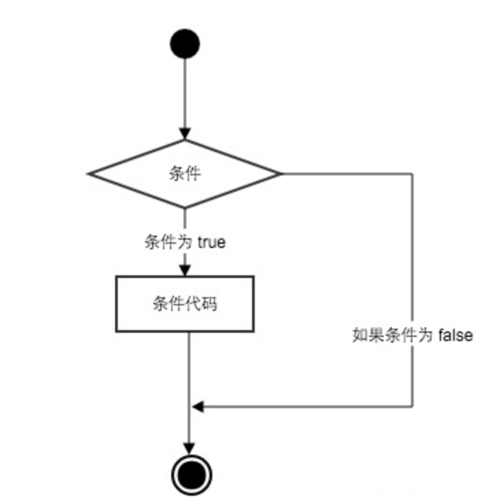
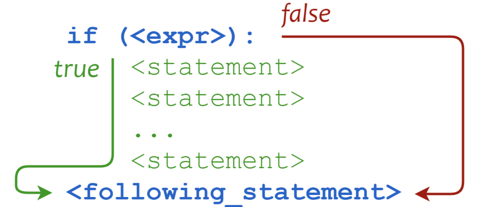
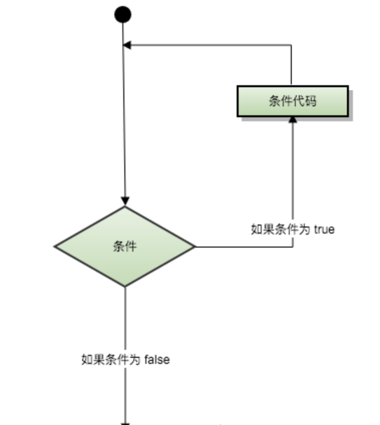
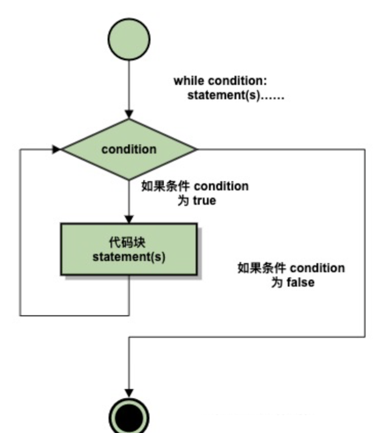
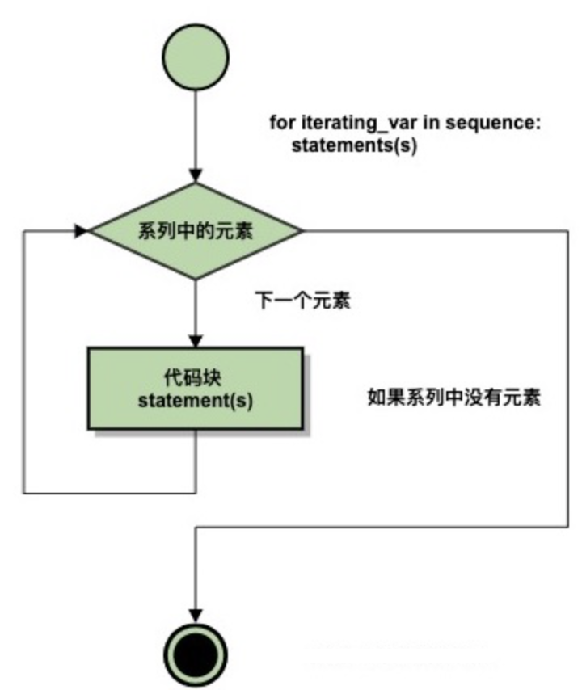
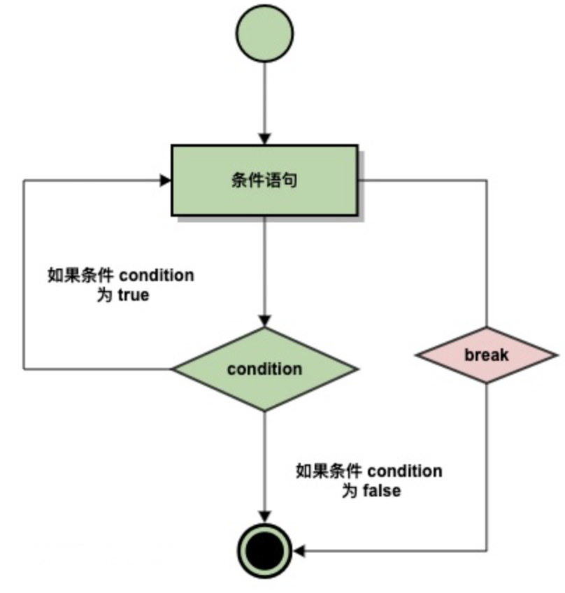
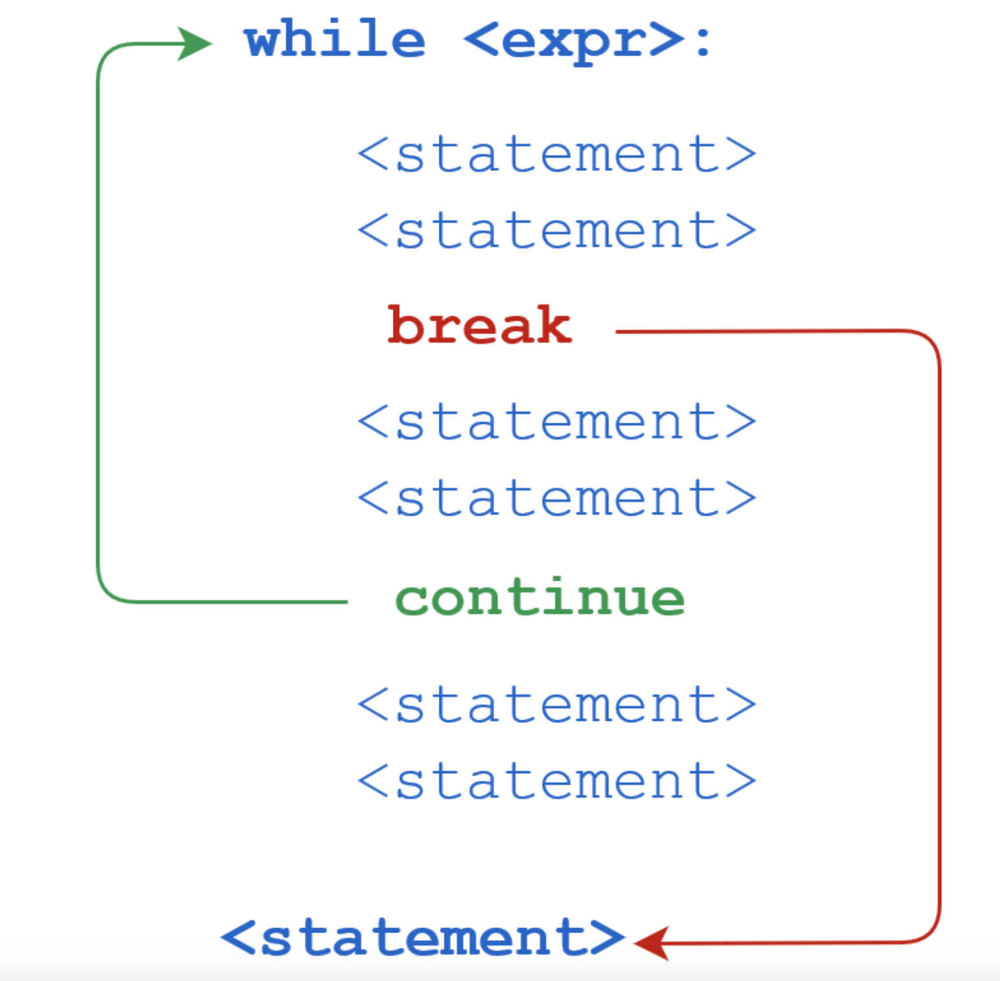

# Lesson2 条件和循环
## 目录

  - [1 条件控制](#1-条件控制)
    - [1.1 if 语句](#11-if-语句)
    - [1.2 if 嵌套](#12-if-嵌套)
    - [1.3 match...case](#13-matchcase)
  - [2 循环](#2-循环)
    - [2.1 while 循环](#21-while-循环)
    - [2.2 无限循环](#22-无限循环)
    - [2.3 while 循环使用 else 语句](#23-while-循环使用-else-语句)
    - [2.4 简单语句组](#24-简单语句组)
    - [2.5 for 语句](#25-for-语句)
    - [2.6 range() 函数](#26-range-函数)
    - [2.7 break 和 continue 语句及循环中的 else 子句](#27-break-和-continue-语句及循环中的-else-子句)
    - [2.8 pass 语句](#28-pass-语句)
  - [课后练习](#课后练习)
    - [1. 点餐程序](#1-点餐程序)
    - [2. Python 猜数字游戏](#2-python-猜数字游戏)

## 1 条件控制

Python 条件语句是通过一条或多条语句的执行结果（True 或者 False）来决定执行的代码块。

可以通过下图来简单了解条件语句的执行过程：



代码执行过程：

### 1.1 if 语句

Python中if语句的一般形式如下所示：

```
if condition_1:
    statement_block_1
elif condition_2:
    statement_block_2
else:
    statement_block_3
```

- 如果 "condition_1" 为 True 将执行 "statement_block_1" 块语句
- 如果 "condition_1" 为False，将判断 "condition_2"
- 如果"condition_2" 为 True 将执行 "statement_block_2" 块语句
- 如果 "condition_2" 为False，将执行"statement_block_3"块语句


Python 中用 **elif** 代替了 **else if**，所以if语句的关键字为：**if – elif – else**。

**注意：**

- 1、每个条件后面要使用冒号 **:**，表示接下来是满足条件后要执行的语句块。
- 2、使用缩进来划分语句块，相同缩进数的语句在一起组成一个语句块。
- 3、在 Python 中没有 **switch...case** 语句，但在 Python3.10 版本添加了 **match...case**，功能也类似，详见下文。

以下是一个简单的 if 实例：

```python
var1 = 100
if var1:
    print("if 表达式条件为 true（即var1不为零）")
    print(var1)

var2 = 0
if var2:
    print("if 表达式条件为 true（即var2不为零)")
    print(var2)
else:
    print("if 表达式条件为 False（即var2为零)")
```

输出结果为：

```
if 表达式条件为 true（即var1不为零）
100
if 表达式条件为 False（即var2为零)
```

从结果可以看到由于变量 var2 为 0，所以对应的 if 内的语句没有执行。

以下实例演示了狗的年龄计算判断：

```python
age = int(input("请输入你家狗狗的年龄: "))
print("")
if age <= 0:
    print("你是在逗我吧!")
elif age == 1:
    print("相当于 14 岁的人。")
elif age == 2:
    print("相当于 22 岁的人。")
elif age > 2:
    human = 22 + (age -2)*5
    print("对应人类年龄: ", human)
 
# 退出提示
input("点击 enter（回车） 键退出")
```

输出结果示例：

```
请输入你家狗狗的年龄: 5

对应人类年龄:  37
点击 enter（回车） 键退出
```

以下为if中常用的操作运算符：

| 操作符 | 描述                     |
| :----- | :----------------------- |
| `<`    | 小于                     |
| `<=`   | 小于或等于               |
| `>`    | 大于                     |
| `>=`   | 大于或等于               |
| `==`   | 等于，比较两个值是否相等 |
| `!=`   | 不等于                   |


给出操作符运算的输出实例：

```python
# 程序演示了 == 操作符
# 使用数字
print(5 == 6)
# 使用变量
x = 5
y = 8
print(x == y)
```

以上实例输出结果：

```
False
False
```

一个数字猜谜游戏：

```python
# 该实例演示了数字猜谜游戏
import random  #python自带的生成随机数的库
number = random.randint(0,10) #生成0-10之间的整数（以后会详细讲到）
guess = 0
print("数字猜谜游戏!")
while guess != number:
    guess = int(input("请输入你猜的数字："))

    if guess == number:
        print("恭喜，你猜对了！")
    elif guess < number:
        print("猜的数字小了...")
    elif guess > number:
        print("猜的数字大了...")
```

实例输出结果如下：

```
数字猜谜游戏!
请输入你猜的数字：5
猜的数字小了...
请输入你猜的数字：7
猜的数字小了...
请输入你猜的数字：8
猜的数字小了...
请输入你猜的数字：9
猜的数字小了...
请输入你猜的数字：10
恭喜，你猜对了！
```

### 1.2 if 嵌套

在嵌套 if 语句中，可以把 if...elif...else 结构放在另外一个 if...elif...else 结构中。

```
if 表达式1:
    语句
    if 表达式2:
        语句
    elif 表达式3:
        语句
    else:
        语句
elif 表达式4:
    语句
else:
    语句
```

实例：

```python
num=int(input("输入一个数字："))
if num%2==0:
    if num%3==0:
        print ("你输入的数字可以整除 2 和 3")
    else:
        print ("你输入的数字可以整除 2，但不能整除 3")
else:
    if num%3==0:
        print ("你输入的数字可以整除 3，但不能整除 2")
    else:
        print  ("你输入的数字不能整除 2 和 3")
```

输出结果为：

```
输入一个数字：10
你输入的数字可以整除 2，但不能整除 3
```

### 1.3 match...case

Python 3.10 增加了 **match...case** 的条件判断，不需要再使用一连串的 **if-else** 来判断了。

match 后的对象会依次与 case 后的内容进行匹配，如果匹配成功，则执行匹配到的表达式，否则直接跳过，**_** 可以匹配一切。

语法格式如下：

```
match subject:
    case <pattern_1>:
        <action_1>
    case <pattern_2>:
        <action_2>
    case <pattern_3>:
        <action_3>
    case _:
        <action_wildcard>
```

**case _:** 类似于 C 和 Java 中的 **default:**，当其他 case 都无法匹配时，匹配这条，保证永远会匹配成功。

```python
def http_error(status):
    match status:
        case 400:
            return "Bad request"
        case 404:
            return "Not found"
        case 418:
            return "I'm a teapot"
        case _:
            return "Something's wrong with the internet"

mystatus=400
print(http_error(mystatus))
```

以上是一个输出 HTTP 状态码的实例，输出结果为：

```
Bad request
```

一个 case 也可以设置多个匹配条件，条件使用 **｜** 隔开，例如：

```
...
    case 401|403|404:
        return "Not allowed"
```

## 2 循环

Python 中的循环语句有 for 和 while。

Python 循环语句的控制结构图如下所示：



### 2.1 while 循环

Python 中 while 语句的一般形式：

```
while 判断条件(condition)：
    执行语句(statements)……
```

执行流程图如下：



同样需要注意冒号和缩进。另外，在 Python 中没有 do..while 循环。

以下实例使用了 while 来计算 1 到 100 的总和：

```python
n = 100
 
sum = 0
counter = 1
while counter <= n:
    sum = sum + counter
    counter += 1
 
print("1 到 %d 之和为: %d" % (n,sum))
```

执行结果如下：

```
1 到 100 之和为: 5050
```

### 2.2无限循环

我们可以通过设置条件表达式永远不为 false 来实现无限循环，实例如下：

```python
var = 1
while var == 1 :  # 表达式永远为 true
   num = int(input("输入一个数字  :"))
   print ("你输入的数字是: ", num)
 
print ("Good bye!")
```

执行以上脚本，输出结果如下：

```
输入一个数字:5
你输入的数字是: 5
输入一个数字:2
你输入的数字是: 2
输入一个数字:	
```

无限循环在服务器上客户端的实时请求非常有用。

### 2.3 while 循环使用 else 语句

如果 while 后面的条件语句为 false 时，则执行 else 的语句块。

语法格式如下：

```
while <expr>:
    <statement(s)>
else:
    <additional_statement(s)>
```

expr 条件语句为 true 则执行 statement(s) 语句块，如果为 false，则执行 additional_statement(s)。

循环输出数字，并判断大小：

```python
count = 0
while count < 5:
   print (count, " 小于 5")
   count = count + 1
else:
   print (count, " 大于或等于 5")
```

执行以上脚本，输出结果如下：

```
0  小于 5
1  小于 5
2  小于 5
3  小于 5
4  小于 5
5  大于或等于 5
```

### 2.4 简单语句组

类似 if 语句的语法，如果你的 while 循环体中只有一条语句，你可以将该语句与 while 写在同一行中， 如下所示：

```python
flag = 1
 
while (flag): print ('CodeRaft泛编程!')
```

需要主动终止输出。


### 2.5 for 语句

Python for 循环可以遍历任何可迭代对象，如一个列表或者一个字符串。

for循环的一般格式如下：

```
for <variable> in <sequence>:
    <statements>
else:
    <statements>
```



Python for 循环实例：

```python
sites = ["Baidu", "Google","Taobao"] #列表形式储存
for site in sites:
    print(site)
```

以上代码执行输出结果为：

```
Baidu
Google
Taobao
```

也可用于打印字符串中的每个字符：

```python
word = 'CodeRaft'
 
for letter in word:
    print(letter)
```

以上代码执行输出结果为：

```
C
o
d
e
R
a
f
t
```

整数范围值可以配合 range() 函数使用：

```python
#1 到 5 的所有数字：
for number in range(1, 6):
    print(number)
```

以上代码执行输出结果为：

```
1
2
3
4
5
```

在 Python 中，for...else 语句用于在循环结束后执行一段代码。

语法格式如下：

```
for item in iterable:
    # 循环主体
else:
    # 循环结束后执行的代码
```

当循环执行完毕（即遍历完 iterable 中的所有元素）后，会执行 else 子句中的代码，如果在循环过程中遇到了 break 语句，则会中断循环，此时不会执行 else 子句。

```python
for x in range(6):
  print(x)
else:
  print("Finally finished!")
```

执行脚本后，输出结果为：

```
0
1
2
3
4
5
Finally finished!
```

以下 for 实例中使用了 break 语句，break 语句用于跳出当前循环体，不会执行 else 子句：

```python
sites = ["Baidu", "Google","Taobao"]
for site in sites:
    if site == "Google":
        print("谷歌！")
        break
    print("国际大厂： " + site)
else:
    print("没有完成循环")
print("完成循环!")
```

执行脚本后，在循环到 "Google"时会跳出循环体：

```
国际大厂： Baidu
谷歌！
完成循环!
```

### 2.6 range() 函数

如果你需要遍历数字序列，可以使用内置 range() 函数，range括号的内的参数为左开右闭区间[   )，分别为遍历的起始数，终止数，以及步长，如果不声明，默认起始为0，步长为1。它会生成数列，例如:

```
>>>for i in range(5):
...     print(i)
...
0
1
2
3
4
```

你也可以使用 range() 指定区间的值：

```
>>>for i in range(5,9) :
    print(i)
 
    
5
6
7
8
>>>
```

也可以使 range() 以指定数字开始并指定不同的增量(甚至可以是负数，叫做'步长'):


```
>>>for i in range(0, 10, 3) :
    print(i)
 
    
0
3
6
9
>>>
```
实现倒序遍历：

```
>>>for i in range(5,1,-1):
		print(i)
    
5
4
3
2	
>>>
```

负数：

```
>>>for i in range(-10, -100, -30) :
    print(i)
 
    
-10
-40
-70
>>>
```

结合 range() 和 len() 函数以遍历一个序列的索引,如下所示：

```
>>>a = ['Google', 'Baidu', 'Taobao', 'QQ']
>>> for i in range(len(a)):
...     print(i, a[i])
... 
0 Google
1 Baidu
2 Taobao
3 QQ
>>>
```

还可以使用 range() 函数来创建一个列表：

```
>>>list(range(5))
[0, 1, 2, 3, 4]
>>>
```

#### break 和 continue 语句及循环中的 else 子句

**break 执行流程图：**



**continue 执行流程图：**


while 语句代码执行过程：



or 语句代码执行过程：


**break** 语句可以跳出 for 和 while 的循环体。如果你从 for 或 while 循环中终止，任何对应的循环 else 块将不执行。

**continue** 语句被用来告诉 Python 跳过当前循环块中的剩余语句，然后继续进行下一轮循环。


实例：

while 中使用 break：

```python
n = 5
while n > 0:
    n -= 1
    if n == 2:
        break
    print(n)
print('循环结束。')
```

结果：

```
4
3
循环结束。
```

while 中使用 continue：

```python
n = 5
while n > 0:
    n -= 1
    if n == 2:
        continue
    print(n)
print('循环结束。')
```

结果：

```
4
3
1
0
循环结束。
```

循环语句可以有 else 子句，它在穷尽列表(以for循环)或条件变为 false (以while循环)导致循环终止时被执行，但循环被 break 终止时不执行。

如下实例用于查询质数的循环例子：

```python
for n in range(2, 10):
    for x in range(2, n):
        if n % x == 0:
            print(n, '等于', x, '*', n//x)
            break
    else:
        # 循环中没有找到元素
        print(n, ' 是质数')
```

结果：

```
2  是质数
3  是质数
4 等于 2 * 2
5  是质数
6 等于 2 * 3
7  是质数
8 等于 2 * 4
9 等于 3 * 3
```

### 2.7 pass 语句

Python pass是空语句，是为了保持程序结构的完整性。

pass 不做任何事情，一般用做占位语句，如下实例

```
>>>while True:
...     pass  # 等待键盘中断
```

以下实例在字母为 o 时 执行 pass 语句块：

```python
for letter in 'CodeRaft':
    if letter == 'f':
        pass
        print('执行 pass 块')
    print('当前字母 :', letter)

print("Good bye!")
```

结果：

```
当前字母 : C
当前字母 : o
当前字母 : d
当前字母 : e
当前字母 : R
当前字母 : a
执行 pass 块
当前字母 : f
当前字母 : t
Good bye!
```

## 课后练习

### 1.点餐程序

题目描述：

设计一个简单的餐厅点单程序，程序能够连续接受多个顾客的点单。程序提前知道汉堡、薯条和可乐的价格。每位顾客可以选择点汉堡、薯条和可乐的数量，程序将输出每位顾客的点单内容和总价，最后输出所有顾客的总销售额。

#### 要求：

1. 程序开始时，定义汉堡、薯条和可乐的价格常量。
2. 使用循环语句连续接受顾客的点单，在开始计算前，可以设置一个专用的变量获取用户意图是继续点单还是退出（例：输入-1退出并计算总销售额，其他数字则进行下一轮点单）。
3. 每次接受顾客的点单后，输出顾客的点单内容和本次点单的总价。
4. 累加每位顾客的点单总价到总销售额中。
5. 退出点单后，输出所有顾客的总销售额。

#### 示例运行：

假设操作流程如下：

1. 第一位顾客点汉堡 2，薯条 1，可乐 3；
2. 第二位顾客点汉堡 1，薯条 2，可乐 2；
3. 选择退出程序。

参考示例：

```
输入-1退出并计算总销售额，其他数字继续点单: 1
请输入汉堡的数量: 2
请输入薯条的数量: 1
请输入可乐的数量: 3
顾客点单内容: 汉堡 2 个, 薯条 1 份, 可乐 3 瓶
本次点单总价: 44.50 元
输入-1退出并计算总销售额，其他数字继续点单: 1
请输入汉堡的数量: 1
请输入薯条的数量: 2
请输入可乐的数量: 2
顾客点单内容: 汉堡 1 个, 薯条 2 份, 可乐 2 瓶
本次点单总价: 33.50 元
输入-1退出并计算总销售额，其他数字继续点单: -1
所有顾客的总销售额: 78.00 元
```

参考代码：

```python
# 餐厅点单程序

# 定义商品的价格常量
PRICE_BURGER = 12.5  # 汉堡的价格
PRICE_FRIES = 6  # 薯条的价格
PRICE_COKE = 4.5  # 可乐的价格

# 初始化总销售额
total_sales = 0.0

while True:
    # 提示用户输入是否继续点单，-1表示退出
    user_input = input("输入-1退出并计算总销售额，其他数字继续点单: ")
    if user_input == '-1':
        break

    # 接受顾客的点单
    try:
        num_burgers = int(input("请输入汉堡的数量: "))
        num_fries = int(input("请输入薯条的数量: "))
        num_cokes = int(input("请输入可乐的数量: "))
    except ValueError:
        print("请输入有效的数量。")
        continue

    # 计算当前顾客的点单总价
    total_price = num_burgers * PRICE_BURGER + num_fries * PRICE_FRIES + num_cokes * PRICE_COKE

    # 输出当前顾客的点单内容和总价
    print(f"顾客点单内容: 汉堡 {num_burgers} 个, 薯条 {num_fries} 份, 可乐 {num_cokes} 瓶")
    print(f"本次点单总价: {total_price:.2f} 元")

    # 将本次点单总价累加到总销售额中
    total_sales += total_price

# 输出所有顾客的总销售额
print(f"所有顾客的总销售额: {total_sales:.2f} 元")
```

### 2.Python 猜数字游戏

**题目描述**： 编写一个Python程序来实现一个猜数字游戏。程序将随机选择一个在1到100之间的数字，用户需要通过输入来猜这个数字，程序根据用户的猜测给出提示（猜高了、猜低了或猜对了），直到用户猜对为止。

**具体要求**：

1. 程序一开始应随机生成一个1到100之间的数字。
2. 用户输入猜测的数字，程序根据用户的输入给出相应的提示。
3. 如果用户猜对了，显示猜对的信息并结束游戏。
4. 如果用户猜错，根据猜测的数字是高于还是低于目标数字，给出相应的提示，并让用户继续猜。
5. 使用循环确保游戏可以继续进行，直到用户猜对为止。

参考示例：

```
欢迎参加猜数字游戏！请猜一个1到100之间的数字。
请输入你的猜测：50
太低了，再试试看！
请输入你的猜测：75
太高了，再试试看！
请输入你的猜测：62
恭喜你，猜对了！正确答案就是62。
游戏结束。谢谢参与！
```

参考代码：

```python
import random

# 生成一个1到100之间的随机数
target_number = random.randint(1, 100)
guess = None

# 游戏欢迎信息
print("欢迎参加猜数字游戏！请猜一个1到100之间的数字。")

# 开始猜数字的循环
while guess != target_number:
    # 获取用户输入
    guess = int(input("请输入你的猜测："))

    # 判断猜测结果
    if guess < target_number:
        print("太低了，再试试看！")
    elif guess > target_number:
        print("太高了，再试试看！")
    else:
        print(f"恭喜你，猜对了！正确答案就是{target_number}。")

# 结束游戏
print("游戏结束。谢谢参与！")
```

