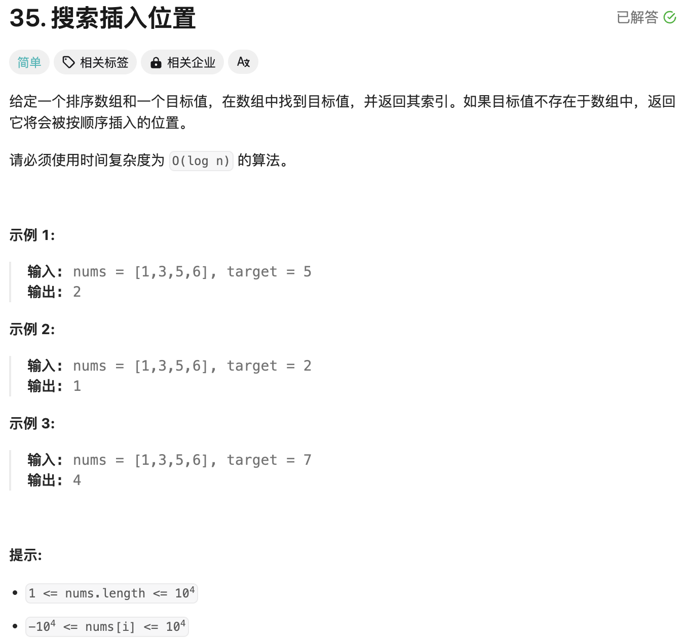
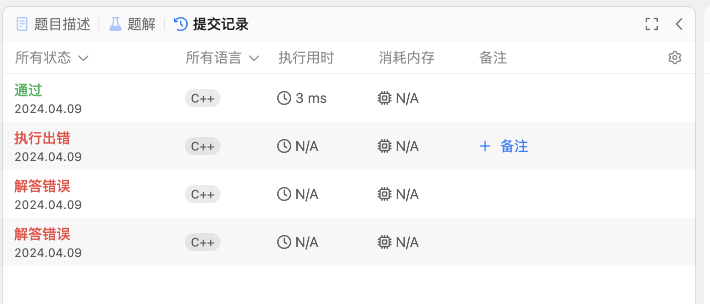
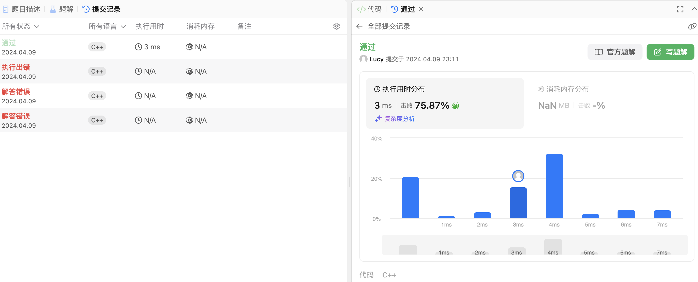

# Lesson6 Leetcode入门/常用的字符串函数/Leetcode字符串练习

## 目录

- [1. Leetcode入门](#1-leetcode入门)
    - [1.1 初识Leetcode](#11-初识leetcode)
    - [1.2 Leetcode 题目](#12-leetcode-题目)
    - [1.3 Leetcode题解](#13-leetcode题解)
    - [1.4 Leetcode提交记录](#14-leetcode提交记录)
    - [1.5 Leetcode做题分析](#15-leetcode做题分析)

- [2. 更多常用字符串函数用法和文档查找方法](#2-更多常用字符串函数用法和文档查找方法)

- [3. Leetcode 题目练习](#3-leetcode-题目练习)
    - [例题讲解](#例题讲解)
        - [LC 58 最后一个单词的字数](#lc-58-最后一个单词的字数)
        - [LC434. 字符串中的单词数](#lc434-字符串中的单词数)
    - [举一反三](#举一反三)
        - [LC709. 转换成小写字母](#lc709-转换成小写字母)
        - [LC520. 检测大写字母](#lc520-检测大写字母)
        - [LC521. 最长特殊序列 Ⅰ](#lc521-最长特殊序列-Ⅰ)

- [课后练习](#课后练习)

## 1. Leetcode入门

### 1.1 初识Leetcode
LeetCode是一个在线编程竞技平台，旨在帮助‌程序员提升编程技能和解决算法问题。它提供了丰富的题库，包括各种编程语言的题目，覆盖了算法、‌数据结构、‌系统设计等多个领域。LeetCode不仅是一个练习平台，也是一个技术社区，用户可以在上面提交代码解决方案，并与其他开发者交流学习。
官网：https://leetcode.cn


- **首先在菜单中点击‘题库’：**


- **搜索框中可以输入题号、标题等查找相应题目**


- **搜索时可以设置题目难度**


### 1.2 Leetcode 题目

题目描述：

1. 文字描述

2. 实例：给一些有代表性的输入与输出，并给出解释

3. 提示：给出一些变量在test case中的范围

以下用LC35题作为例子

### 1.3 Leetcode题解

题解：点击题解后即可查看该题的几种解法

### 1.4 Leetcode提交记录

点击‘提交记录’可查看以往提交内容


点击其中一条，即出现该次提交的详情，包括性能与代码内容


### 1.5 Leetcode做题分析

点击头像，查看做题分析、进度管理等，即可查看自己的做题内容


下面是一个常用的C++字符串方法的表格，展示了C++中常见的字符串操作及其描述：

| 序号 | 方法及描述                                                   |
|:---| :----------------------------------------------------------- |
| 1  | `str.size()` 或 `str.length()` 返回字符串的长度。 |
| 2  | `str.empty()` 判断字符串是否为空。 |
| 3  | `str[index]` 或 `str.at(index)` 访问字符串中的字符。`at()` 带有越界检查。 |
| 4  | `str.find(subStr)` 查找子字符串在当前字符串中的第一次出现位置，返回找到的索引或 `std::string::npos`。 |
| 5  | `str.substr(pos, len)` 提取从位置 `pos` 开始的长度为 `len` 的子字符串。 |
| 6  | `str.append(str2)` 或 `str += str2` 将字符串 `str2` 添加到当前字符串 `str` 的末尾。 |
| 7  | `str.insert(pos, str2)` 在位置 `pos` 插入字符串 `str2`。 |
| 8  | `str.erase(pos, len)` 删除从位置 `pos` 开始长度为 `len` 的子字符串。 |
| 9 | `std::string::npos` 常量，用于表示字符串中不存在子字符串时的返回值。 |
| 10 | `str.clear()` 清空字符串内容，使其长度变为0。 |
| 11 | `str.swap(str2)` 交换两个字符串的内容。 |
| 12 | `std::reverse(str.begin(), str.end())` 反转字符串的字符顺序。 |


## 3. Leetcode 题目练习
从本节课程开始，我们将结合Leetcode上的经典题目进行教学

## 例题讲解
### LC 58 最后一个单词的字数

给你一个字符串 `s`，由若干单词组成，单词前后用一些空格字符隔开。返回字符串中 **最后一个单词的长度**。

**单词** 是指仅由字母组成、不包含任何空格字符的最大子字符串。


### 思路

1. **去除字符串末尾的空格**: 字符串可能在末尾包含空格，我们首先要去掉这些空格，以便准确找到最后一个单词。
  
2. **从字符串末尾开始向前遍历**: 从字符串的末尾开始向前遍历，找到第一个字母后继续计数，直到找到空格或者到达字符串的起始位置，这段计数就是最后一个单词的长度。

### 参考解答

**反向遍历方法**：

1. 从字符串的末尾开始，找到第一个非空格字符，这个字符是最后一个单词的最后一个字母。
2. 从这个字母开始反向遍历，直到遇到空格或者到达字符串的起始位置。遍历到的每个字母都是最后一个单词的一部分。
3. 遍历到的字母数量即为最后一个单词的长度。

```cpp  
class Solution {
public:
    int lengthOfLastWord(string s) {
        int index = s.length() - 1;
        // 跳过尾部空格
        while (index >= 0 && s[index] == ' ') {
            index--;
        }
        int wordLength = 0;
        // 计算最后一个单词的长度
        while (index >= 0 && s[index] != ' ') {
            wordLength++;
            index--;
        }
        return wordLength;
    }
};
```


### LC434. 字符串中的单词数

### 问题描述

统计字符串中的单词个数，这里的单词指的是连续的不是空格的字符。

请注意，你可以假定字符串里不包括任何不可打印的字符。

### 题目分析

我们需要统计字符串中的单词个数，单词是由连续的非空格字符组成的。空格可以用来分隔单词。题目保证字符串中没有不可打印字符，因此不需要处理特殊字符。

### 思路
**常规思路**
1. **去除多余空格**: 在处理字符串之前，我们可以先考虑如何处理字符串中可能存在的多余空格问题（如前后空格或多重空格）。但实际实现中，通常不需要专门去除空格，只需要正确地分割单词即可。   
   检测一个单词的开始：

   - `s[i] != ' '`：当前字符不是空格。
   - `(i == 0 || s[i - 1] == ' ')`：当前字符是第一个字符，或者前一个字符是空格。

   满足这两个条件时，意味着我们遇到一个新的单词，于是计数器 `count` 增加。

2. **遍历字符串**: 我们可以遍历字符串，并在遇到非空格字符时，识别到一个新的单词开始。当遇到空格字符时，则表示当前单词结束。

3. **记录单词数量**: 使用一个计数器，当检测到一个单词的开始时，计数器加1。

```cpp
class Solution {
public:
    int countSegments(string s) {
        int count = 0;
        // 遍历字符串
        for (int i = 0; i < s.length(); i++) {
            // 检查当前字符是否为非空格字符且前一个字符为空格字符
            if (s[i] != ' ' && (i == 0 || s[i - 1] == ' ')) {
                count++;
            }
        }
        return count;
    }
};
```

## 举一反三

### LC709. 转换成小写字母

#### 问题描述

给你一个字符串 `s`，将该字符串中的大写字母转换成相同的小写字母，返回新的字符串，查找并使用合适的字符串函数解答即可。


#### 代码实现
```cpp
class Solution {
public:
    string toLowerCase(string s) {
        for (int i = 0; i < s.length(); i++) {
            // 使用tolower函数将字符转换为小写
            s[i] = tolower(s[i]);
        }
        return s;
    }
};
```

### LC520. 检测大写字母

### 问题描述

我们定义，在以下情况下，单词的大写用法是正确的：

1. 全部字母都是大写，比如 `"USA"`。
2. 单词中所有字母都不是大写，比如 `"leetcode"`。
3. 如果单词不只含有一个字母，只有首字母大写，比如 `"Google"`。

给你一个字符串 `word`。如果大写用法正确，返回 `true`；否则，返回 `false`。


### 题目分析

这个问题要求我们判断一个单词的大小写是否符合特定的规则。具体的规则包括：

1. **全部字母都是大写**，例如 `"USA"`。
2. **全部字母都不是大写**，例如 `"leetcode"`。
3. **只有首字母大写**，例如 `"Google"`。

如果一个单词符合以上任意一种情况，我们返回 `true`，否则返回 `false`。

### 思路讲解

1. **判断全大写**：使用 `toupper()` 方法，把单词转换为大写，然后检查转换后的单词是否和原始单词相同。如果相同，说明所有字母都大写。

2. **判断全小写**：类似的，使用 `tolower()` 方法，把单词转换为小写，然后检查转换后的单词是否和原始单词相同。如果相同，说明所有字母都小写。

3. **判断首字母大写**：首先检查首字母是否大写（可以使用 `Character.isupper()` 方法），然后检查剩下的字母是否全部是小写。

4. **归纳**：如果满足以上任何一种情况，我们就返回 `true`，否则返回 `false`。

### 代码实现

**常规解法**

```cpp
class Solution {
public:
    bool detectCapitalUse(string word) {
        // 若第 1 个字母为小写，则需额外判断第 2 个字母是否为大写
        if (word.length() >= 2 && islower(word[0]) && isupper(word[1])) {
            return false;
        }

        // 无论第 1 个字母是否大写，其他字母必须与第 2 个字母的大小写相同
        for (int i = 2; i < word.length(); ++i) {
            if (islower(word[i]) ^ islower(word[1])) {
                return false;
            }
        }
        return true;
    }
};
```

### LC521. 最长特殊序列 Ⅰ

#### 问题描述

给你两个字符串 `a` 和 `b`，请返回这两个字符串中最长的特殊序列的长度。如果不存在，则返回 `-1`。

**最长特殊序列** 定义如下：该序列为某字符串独有的最长子序列（即不能是其他字符串的子序列）。

字符串 `s` 的子序列是在从 `s` 中删除任意数量的字符后可以获得的字符串。例如，"abc" 是 "aebdc" 的子序列，因为删除 "aebdc" 中斜体加粗的字符可以得到 "abc"。 "aebdc" 的子序列还包括 "aebdc"、"aeb" 和 ""（空字符串）。


#### 提示
字符串的子序列的长度不会超过该字符串的长度。若子序列的长度等于字符串的长度，那么子序列就是该字符串。

若两字符串不相同，那么我们可以选择较长的字符串作为最长特殊序列，显然它不会是较短的字符串的子序列。特别地，当两字符串长度相同时（但不是同一字符串），我们仍然可以选择其中的一个字符串作为最长特殊序列，它不会是另一个字符串的子序列。

若两字符串相同，那么任一字符串的子序列均会出现在两个字符串中，此时应返回 −1。

#### 题目分析

这个问题要求我们找到两个字符串 `a` 和 `b` 的最长特殊序列。根据题目中的定义，最长特殊序列是指在两个字符串中独有的最长子序列。换句话说，如果一个字符串是另一个字符串的子序列，那么它不是特殊序列。我们的目标是找到最长的特殊序列的长度。

#### 思路

1. **字符串相等的情况**:
   - 如果字符串 `a` 和 `b` 相等，那么每个子序列在另一个字符串中也是存在的。因此，不可能有独有的子序列，直接返回 `-1`。

2. **字符串不相等的情况**:
   - 如果字符串 `a` 和 `b` 不相等，那么较长的字符串本身就是它的最长特殊序列，因为它不能完全出现在另一个字符串中。此时，我们可以直接返回两个字符串中较长的那个字符串的长度。

#### 代码实现
**直观版本**
```cpp
class Solution {
public:
    int findLUSlength(string a, string b) {
        // 如果两个字符串不同，返回长度较长的字符串
        if (a != b) {
            return max(a.length(), b.length());
        }
        // 如果两个字符串相同，返回 -1
        return -1;
    }
};
```

**简洁版本**
```cpp
class Solution {
public:
    int findLUSlength(string a, string b) {
        return a != b ? max(a.length(), b.length()) : -1;
    }
};
```

## 课后练习

| 题目编号 | 题目名称                        | 简介                                              |
| ----- | ------------------------------- | ------------------------------------------------- |
| LC551 | Student Attendence Record I    | 给定一个学生的出勤记录，判断该学生是否存在连续的三天缺勤或有超过10天的旷课。 |
| LC657 | Robot Return to Origin         | 判断给定的机器人移动指令是否使机器人回到原点。   |
| LC1078 | Occurrences After Bigram       | 给定一个文本和一个大字典，找出大字典中出现的单词在文本中出现的次数。 |
| LC557 | Reverse Words in a String III  | 反转字符串中的每个单词，保持单词的顺序不变。      |


